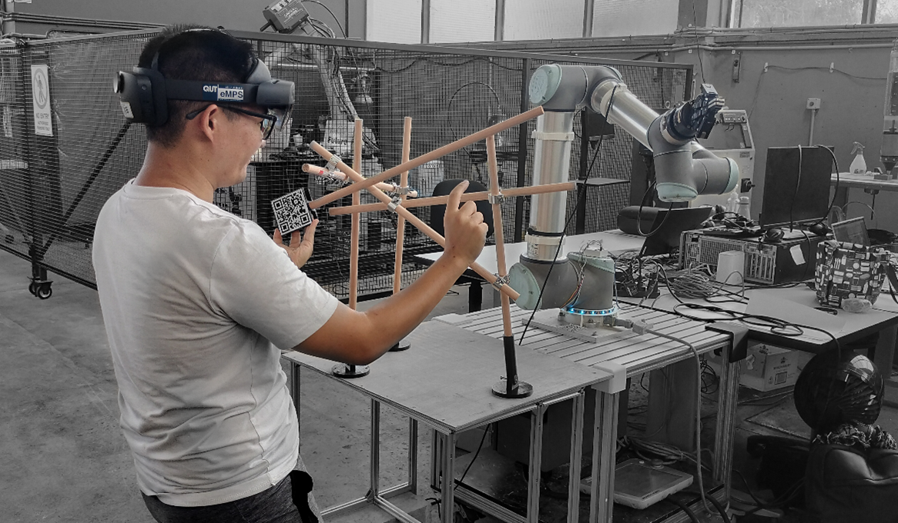

# Workshop: Exploring AR-enabled Human-Robotic Collaboration System for Collaborative Assembly Tasks.

## CAADRIA 2024 @ Singapore University of Technology And Design

> 20-22 April 2021

👉 [Slides](https://docs.google.com/presentation/d/1XioagUYqCVWCgxudyw0m4pQa-cu9_5Pf7duuSE7PYMo) | [Overview](#overview) | [Requirements](#requirements) | [Installation](#installation)

## Overview

### Day 1

* Hands-on Exercise: Collaborative assembly exercise to construct small scale Voronoi structure.
* Hands-on Exercise: Collaborative assembly exercise to construct medium scale Voronoi structure.
* Technical Induction: Surrounding using cooperative robotic arm.
* Hands-on Exercise: Collaborative assembly exercise with cooperative robotic arm in Freedrive mode.
* Group discussion: "How cooperative robotic arm could be used to effectively support architectural designers in collaborative assembly tasks?"
* Digital Exercise: Create a "pick and place" procedure using grasshopper.

### Day 2

* Techinical induction surrounding using Microsoft Hololens 2.
* Demo: Getting participants to try different AR interactive features that offered by Microsoft Hololens 2.
* Digital Exercise: Download Fologram to participants' workstations.
* Digital Exercise: Create a virtual widget that can be used to establish robot waypoints.
* Digital Exercise: Create a virtual button to send robot command to cooperative robotic arm, UR10.
* Group Discussion: How AR could be used to facilitate bi-directional communication between architectural designers and cooperative robotic arm?

### Day 3

* Group Discussion: Explode different design briefs.
* Hands-on Exercise: Get acquainted with the developed AR-enabled HRC system.
* Hands-on Exercise: Construct lightweight structured using the developed AR-enabled HRC system alongside with UR10.
* Group Discussion: Reflecting of the construction process as well as the developed AR-enabled HRC system.
* Closing remark.

## Requirements

* Minimum OS: Windows 10/11
* [Rhino 7/8 & Grasshopper](https://www.rhino3d.com/download)

## Installation

* We use Rhinoceros 3D and Grasshopper to communicate with the cooperative robotic arm, UR10.
* We use grasshopper plugin such as [“Robot”](https://github.com/visose/Robots) to establish connection with the UR10, and [Fologram](https://fologram.com/download) plugin to establish a mixed reality platform.

